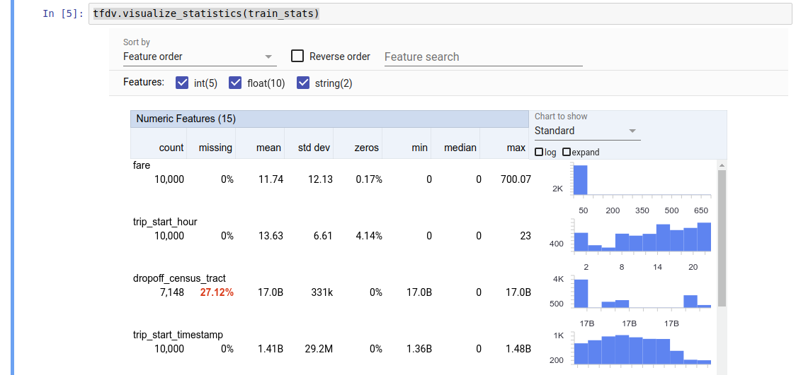
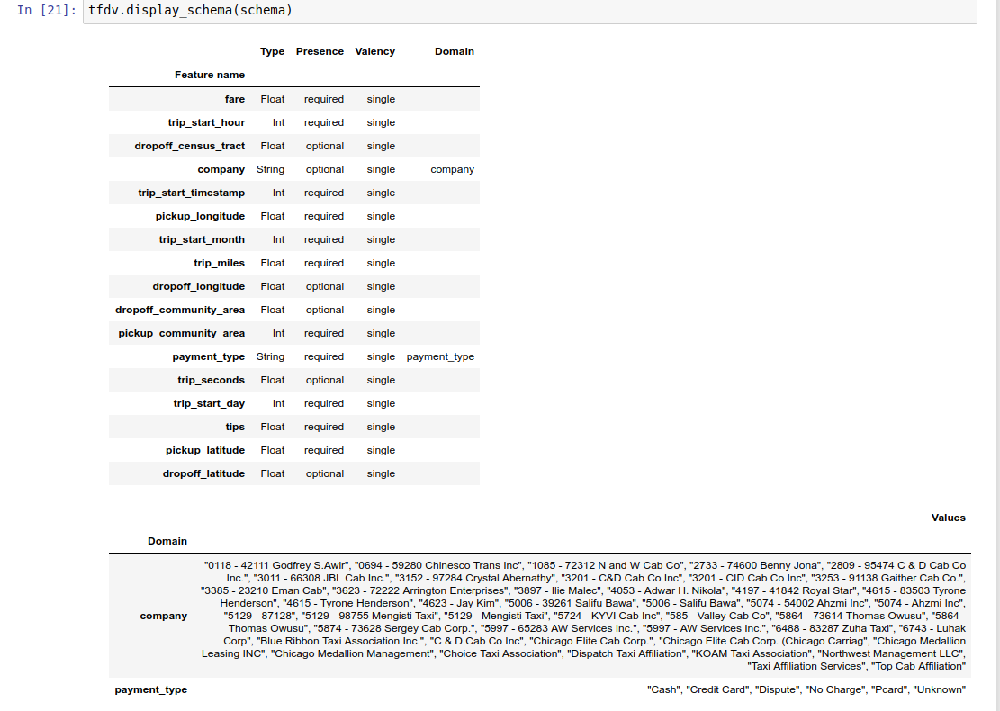

# Get started with Tensorflow Data Validation

Tensorflow Data Validation (TFDV) can analyze training and serving data to:

*   compute descriptive
    [statistics](https://github.com/tensorflow/metadata/tree/master/tensorflow_metadata/proto/v0/statistics.proto),

*   infer a
    [schema](https://github.com/tensorflow/metadata/tree/master/tensorflow_metadata/proto/v0/schema.proto),

*   detect
    [data anomalies](https://github.com/tensorflow/metadata/tree/master/tensorflow_metadata/proto/v0/anomalies.proto).

The core API supports each piece of functionality, with convenience methods that
build on top and can be called in the context of notebooks.

## Computing descriptive data statistics

TFDV can compute descriptive
[statistics](https://github.com/tensorflow/metadata/tree/master/tensorflow_metadata/proto/v0/statistics.proto)
that provide a quick overview of the data in terms of the features that are
present and the shapes of their value distributions. Tools such as
[Facets Overview](https://pair-code.github.io/facets/) can provide a succinct
visualization of these statistics for easy browsing.

For example, suppose that `path` points to a file in the `TFRecord` format
(which holds records of type `tensorflow.Example`). The following snippet
illustrates the computation of statistics using TFDV:

```python
    stats = tfdv.generate_statistics_from_tfrecord(data_location=path)
```

The returned value is a
[DatasetFeatureStatisticsList](https://github.com/tensorflow/metadata/tree/master/tensorflow_metadata/proto/v0/statistics.proto)
protocol buffer, which can be visualized using
[Facets Overview](https://pair-code.github.io/facets/):

```python
    tfdv.visualize_statistics(stats)
```



The previous example assumes that the data is stored in a `TFRecord` file. TFDV
also supports CSV input format, with extensibility for other common formats.
You can find the available data decoders [here]
(https://github.com/tensorflow/data-validation/tree/master/tensorflow_data_validation/coders).

### Running on Google Cloud
Internally, TFDV uses [Apache Beam](https://beam.apache.org)'s data-parallel
processing framework to scale the computation of statistics over large datasets.
For applications that wish to integrate deeper with TFDV (e.g., attach
statistics generation at the end of a data-generation pipeline), the API also
exposes a Beam PTransform for statistics generation. The following snippet shows
an example usage:

```python

    import tensorflow_data_validation as tfdv
    import apache_beam as beam
    from apache_beam.options.pipeline_options import PipelineOptions, GoogleCloudOptions, StandardOptions, SetupOptions
    from tensorflow_metadata.proto.v0 import statistics_pb2

    PROJECT_NAME = ''
    JOB_NAME = ''
    GCS_STAGING_LOCATION = ''
    GCS_TMP_LOCATION = ''
    GCS_DATA_LOCATION = ''
    GCS_OUTPUT_LOCATION = ''

    PATH_TO_WHL_FILE = ''

    # Create and set your PipelineOptions.
    options = PipelineOptions()

    # For Cloud execution, set the Cloud Platform project, job_name,
    # staging location, temp_location and specify DataflowRunner.
    google_cloud_options = options.view_as(GoogleCloudOptions)
    google_cloud_options.project = PROJECT_NAME
    google_cloud_options.job_name = JOB_NAME
    google_cloud_options.staging_location = GCS_STAGING_LOCATION
    google_cloud_options.temp_location = GCS_TMP_LOCATION
    options.view_as(StandardOptions).runner = 'DataflowRunner'

    # Only required until github repo is not public
    # PATH_TO_WHL_FILE should point to a .whl file for tfdv
    options.view_as(SetupOptions).extra_packages = [PATH_TO_WHL_FILE]

    with Pipeline(options=options) as p:
       _ = (
        p
        | 'ReadData' >> beam.io.ReadFromTFRecord(file_pattern=GCS_DATA_LOCATION)
        | 'DecodeData' >> beam.Map(tfdv.TFExampleDecoder().decode)
        | 'GenerateStatistics' >> tfdv.GenerateStatistics()
        | 'WriteStatsOutput' >> beam.io.WriteToTFRecord(
            file_path_prefix = GCS_OUTPUT_PATH,
            coder=beam.coders.ProtoCoder(
                statistics_pb2.DatasetFeatureStatisticsList)))
```

In this case, the generated statistics proto is stored in `output_path`.

## Inferring a schema over the data

The
[schema](https://github.com/tensorflow/metadata/tree/master/tensorflow_metadata/proto/v0/schema.proto)
describes the expected properties of the data. Some of these properties are:

*   which features are expected to be present
*   their type
*   the number of values for a feature in each example
*   the presence of each feature across all examples
*   the expected domains of features.

In short, the schema describes the expectations for "correct" data and can thus
be used to detect errors in the data (described below). Moreover, the same
schema can be used to set up
[Tensorflow Transform](https://github.com/tensorflow/transform) for data
transformations. Note that the schema is expected to be fairly static, e.g.,
several datasets can conform to the same schema, whereas statistics (described
above) can vary per dataset.

Since writing a schema can be a tedious task, especially for datasets with lots
of features, TFDV provides a method to generate an initial version of the schema
based on the descriptive statistics:

```python
    schema = tfdv.infer_schema(stats)
```

In general, TFDV uses conservative heuristics to infer stable data properties
from the statistics in order to avoid overfitting the schema to the specific
dataset. It is strongly advised to **review the inferred schema and refine
it as needed**, to capture any domain knowledge about the data that TFDV's
heuristics might have missed.

The schema itself is stored as a
[Schema protocol buffer](https://github.com/tensorflow/metadata/tree/master/tensorflow_metadata/proto/v0/schema.proto)
and can thus be updated/edited using the standard protocol-buffer API. TFDV also
provides a [few utility methods](https://github.com/tensorflow/data-validation/tree/master/tensorflow_data_validation/utils/schema_util.py)
 to make these updates easier. For instance,
suppose that the schema contains the following stanza to describe a required
string feature `device` that takes a single value:

```json
feature {
  name: "payment_type"
  value_count {
    min: 1
    max: 1
  }
  type: BYTES
  domain: "payment_type"
  presence {
    min_fraction: 1.0
    min_count: 1
  }
}
```

To mark that the feature should be populated in at least 50% of the examples:

```python
    tfdv.get_feature(schema, 'payment_type').presence.min_fraction = 0.5
```

The The [example notebook](https://github.com/tensorflow/data-validation/tree/master/tensorflow_data_validation/examples/chicago_taxi/chicago_taxi_tfdv.ipynb)
contains a simple visualization of the
schema as a table, listing each feature and its main characteristics as encoded
in the schema.




## Checking the data for errors

Given a schema, it is possible to check whether a dataset conforms to the
expectations set in the schema or whether there exist any data anomalies. TFDV
performs this check by matching the statistics of the dataset against the schema
and marking any discrepancies. For example:

```python
    # Assume that other_path points to another TFRecord file
    other_stats = tfdv.generate_statistics_from_tfrecord(data_location=other_path)
    anomalies = tfdv.validate_statistics(statistics=other_stats, schema=schema)
```

The result is an instance of the
[Anomalies](https://github.com/tensorflow/metadata/tree/master/tensorflow_metadata/proto/v0/anomalies.proto)
protocol buffer and describes any errors where the statistics do not agree with
the schema. For example, suppose that the data at `other_path` contains examples
with values for the feature `payment_type` outside the domain specified in the
schema.

This produces an anomaly

```python
   payment_type  Unexpected string values  Examples contain values missing from the schema: Prcard (<1%).
```

indicating that that an out of domain value was found in the stats in < 1% of
the examples.

If this was expected, then the schema can be updated as follows:

```python
   tfdv.get_domain(schema, 'payment_type').value.append('Prcard')
```

If the anomaly truly indicates a data error, then the underlying data should be
fixed before using it for training.

The various anomaly types that can be detected by this module are listed [here](https://github.com/tensorflow/metadata/tree/master/tensorflow_metadata/proto/v0/anomalies.proto).

The [example notebook](https://github.com/tensorflow/data-validation/tree/master/tensorflow_data_validation/examples/chicago_taxi/chicago_taxi_tfdv.ipynb)
contains a simple visualization of the anomalies as
a table, listing the features where errors are detected and a short description
of each error.


